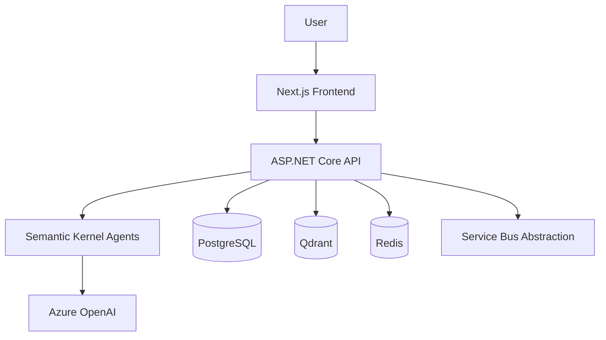

# Architecture Overview

```mermaid
graph TD
User-->Next[Next.js Frontend]
Next-->Api[ASP.NET Core API]
Api-->Agents[Semantic Kernel Agents]
Agents-->AzureOpenAI[Azure OpenAI]
Api-->Postgres[(PostgreSQL)]
Api-->Qdrant[(Qdrant)]
Api-->Redis[(Redis)]
Api-->Bus[Service Bus Abstraction]
```

The platform uses stateless APIs, clean architecture, strategy-based cloud cost providers, and specialized AI agents.
